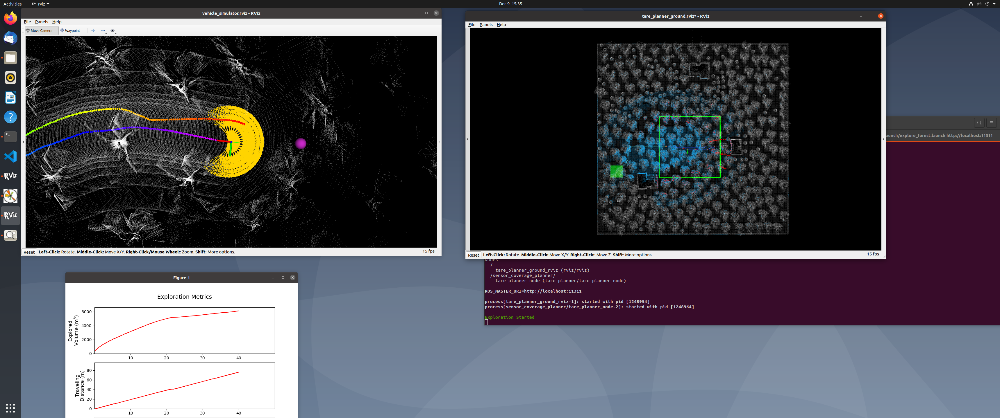

# Selective_Autonomous_Exploration
Author: Fan Ding \
Date: 12/18/2021 \
Description: Selective Autonomous Exploration (SAE) is a method designed for autonomous exploration when resources are limited. It selectively explores the environment. The main ideas is shorten the exploration path, and increase the exploration speed by ignore some inefficient exploration. Compared with completeness, SAE pays more attention to efficiency. SAE prioritizes exploring more volumetric paths in a shorter time. Experiments show that compared with TARE exploration planner, the coverage rate of SAE has increased by 10.4% on average.

## Screenshots

## Slides
https://docs.google.com/presentation/d/1F1tObViWeO_aYeNZInMY5V9tLF0RqI6NeI7C-v87Fkk/edit?usp=sharing

## Instructions
1. Download and run the development environment\
`sudo apt update`\
`sudo apt install libusb-dev`\
`cd autonomous_exploration_development_environment`\
`git checkout distribution`\
`catkin_make`\
`./src/vehicle_simulator/mesh/download_environments.sh`\
`source devel/setup.sh`\
`roslaunch vehicle_simulator system_garage.launch`

2. Run program:\
`catkin_make`\
`source devel/setup.sh`\
`roslaunch tare_planner explore_garage.launch`

